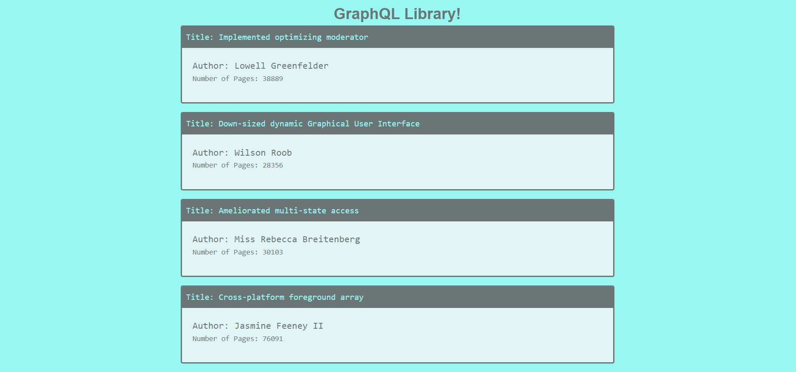

# Simple FullStack GraphQL WebApp

This a simple fullstack GraphQL WebApp that uses the MERN Stack, the app connects to apollo express backend server where it Queries information from MongoDB and displays some book information

## How To Run
Simply use the command npm run dev found in the package.json file remember to npm install here as well as in the client and server folder.
Create an .env file and add your mongo db cloud atlas information.
